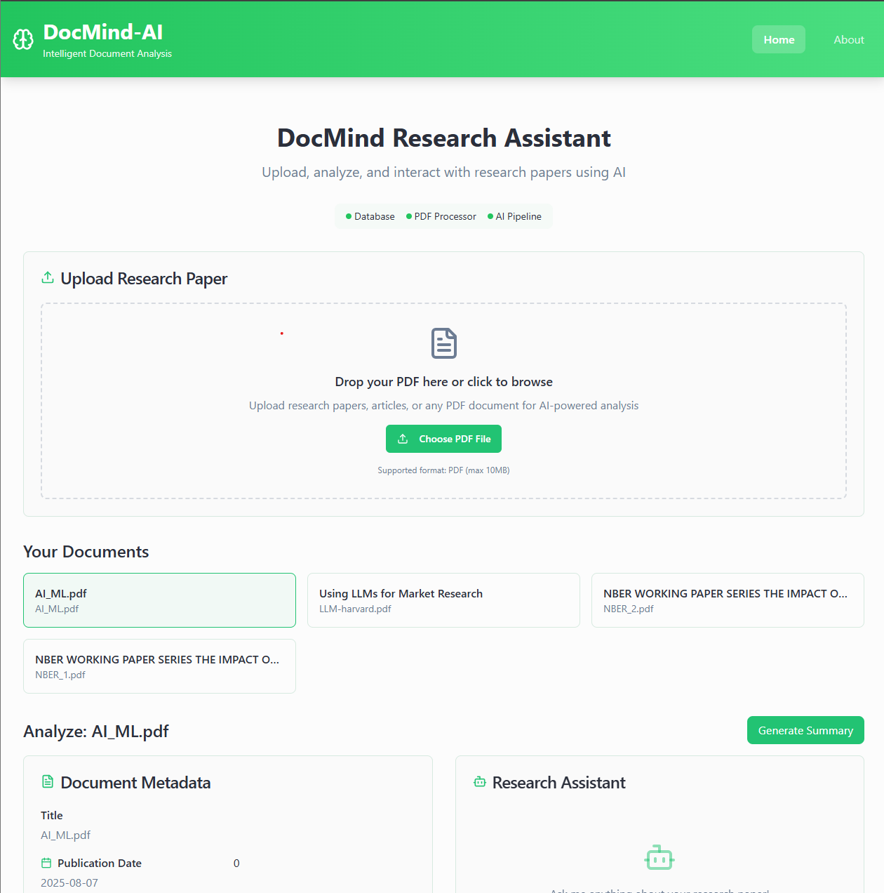
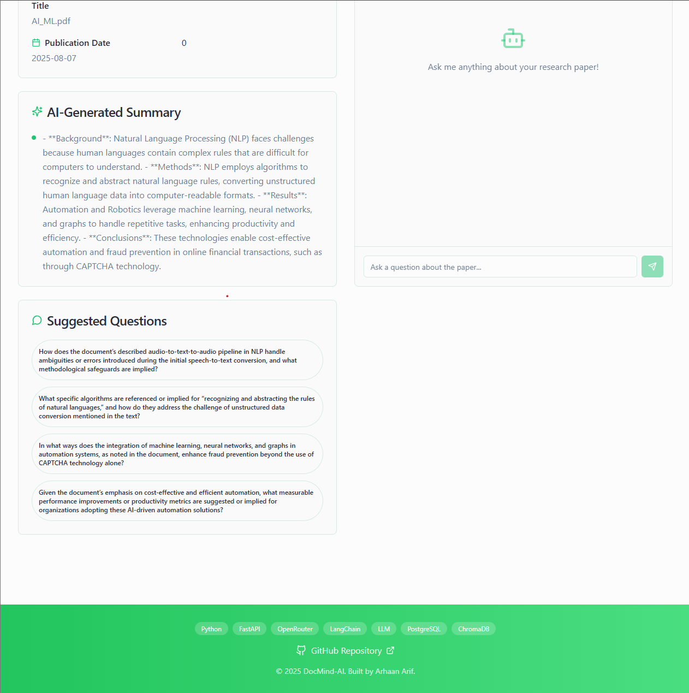
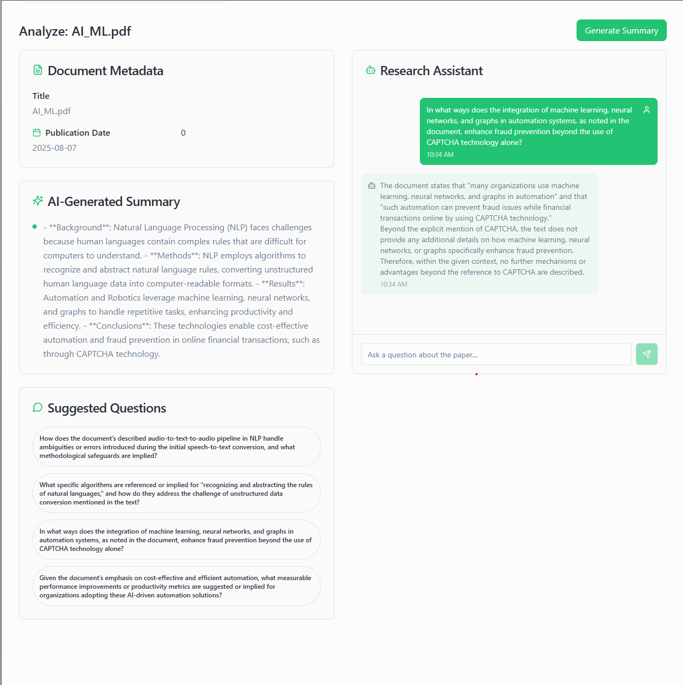
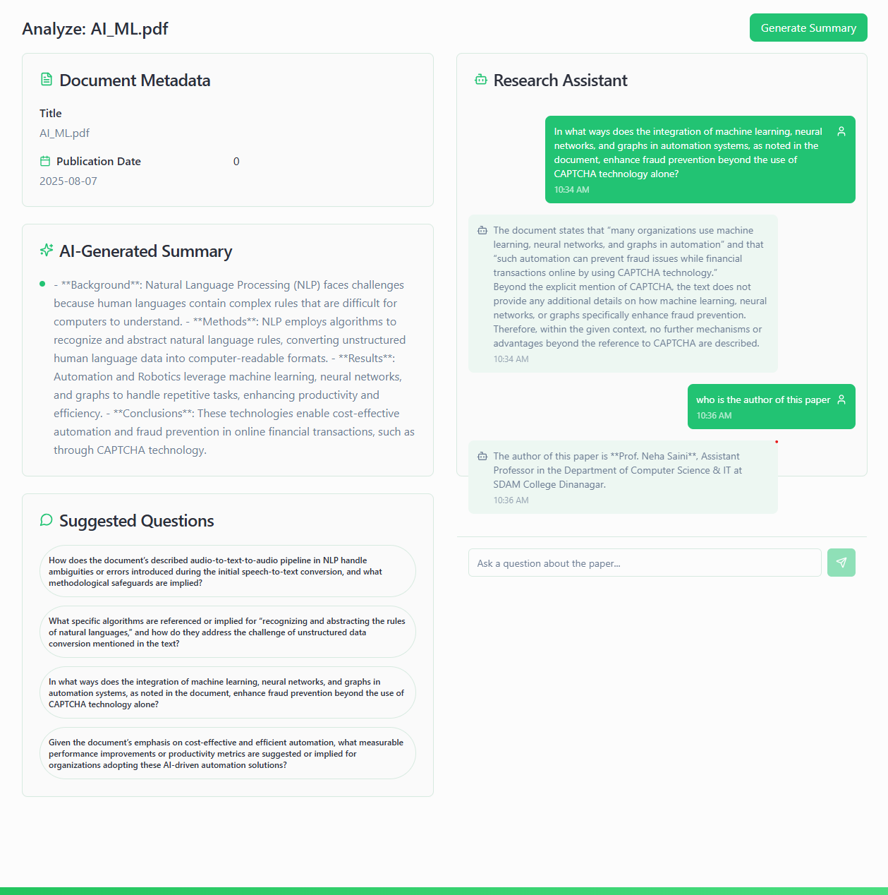
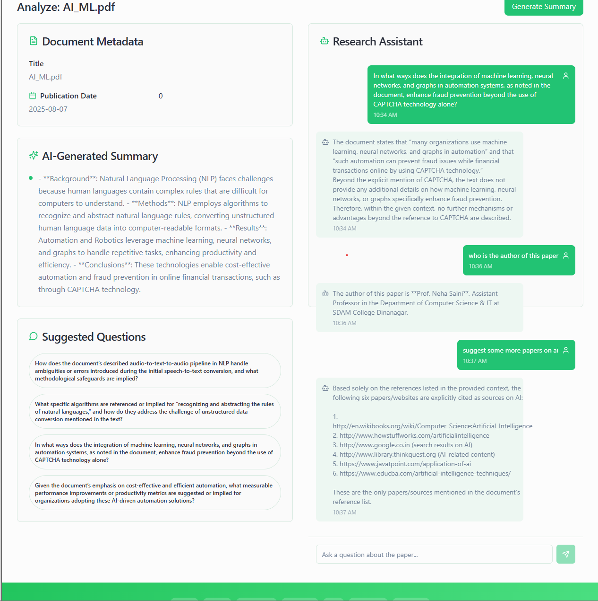
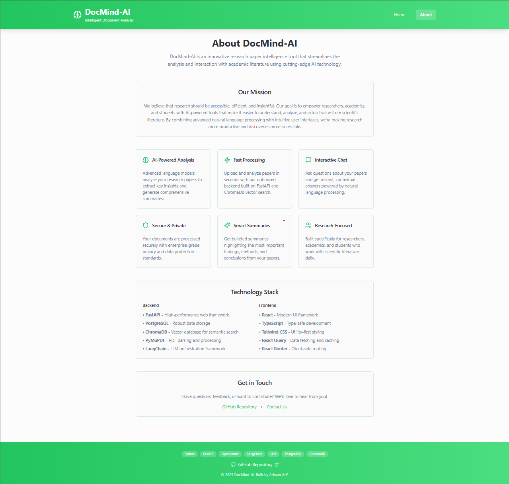

# DocMind
An interactive, AI-powered application that allows users to upload research papers (PDFs), extract structured metadata, generate concise bullet-point summaries, and interact with a RAG-based chatbot for contextual Q&A.

## 🚀 Features
📄 Upload research papers in PDF format

🔍 Automatic metadata extraction through GROBID (title, authors, etc.)

🧾 Bullet-point summarization of long-form content

🤖 Chatbot interface powered by RAG (Retrieval-Augmented Generation)

🔗 FastAPI backend with OpenRouter LLM | Gemini integration

🧠 Embeddings via SentenceTransformers & vector search using ChromaDB

🐳 PostgreSQL containerized via Docker for persistent storage

[]
## 🛠️ Stack Overview

| Layer                   | Tech Used                                 |
|-------------------------|-------------------------------------------|
| Backend API             | FastAPI                                   |
| Chunking & Embeddings   | Langchain & SentenceTransformers          |
| LLM PRovider            | OpenRouter API                            |
| Vector DB               | ChromaDB                                  |
| PDF Processing          | PyMuPDF                                   |
| Database                | PostgreSQL, Docker                        |
| Frontend                | React by Lovable.dev                      |
| API Testing             | Postman                                   |
| Version Control         | Github                                    |
| Developmnent Tools      | VsCode, Github, Copilot, Docker           |

---

## 📚 Example Use Case
Upload a 5-page research paper, and within seconds:

Get structured metadata

View a clear summary

Ask detailed follow-up questions like:
“What methodology was used in section 3?”

---

## Output Screenshots









---

## Software Requirements

- **Operating System:** Windows 10/11, macOS 10.15+, or Linux (Ubuntu 20.04+ recommended)
- **Python:** Version 3.9 or higher.
- **Python Packages** (listed in requirements.txt):
  Use the package manager [pip](https://pip.pypa.io/en/stable/) to install foobar.

```bash
python
fastapi
uvicorn
langchain
sentence-transformers
requests
chromadb
docker
```
---

## Limitations

- Struggles with scanned image PDFs
- Not optimized for multilingual papers
- Query accuracy drops for very large or noisy documents
- No user authentication
- Relies on internet connection to access OpenRouter LLMs


## Installation

- \*\*Clone the Repository:

```bash
git clone https://github.com/arhaanarif/DrowziGuard.git
```

- **Setup Virtual Environment:**

```bash
python -m venv venv
source venv/bin/activate  # On Windows: venv\Scripts\activate
```

- **Install Dependencies:**

```bash
pip install -r requirements.txt
```

## 🤝 Contributing
Pull requests are welcome. Please open issues first to discuss changes.